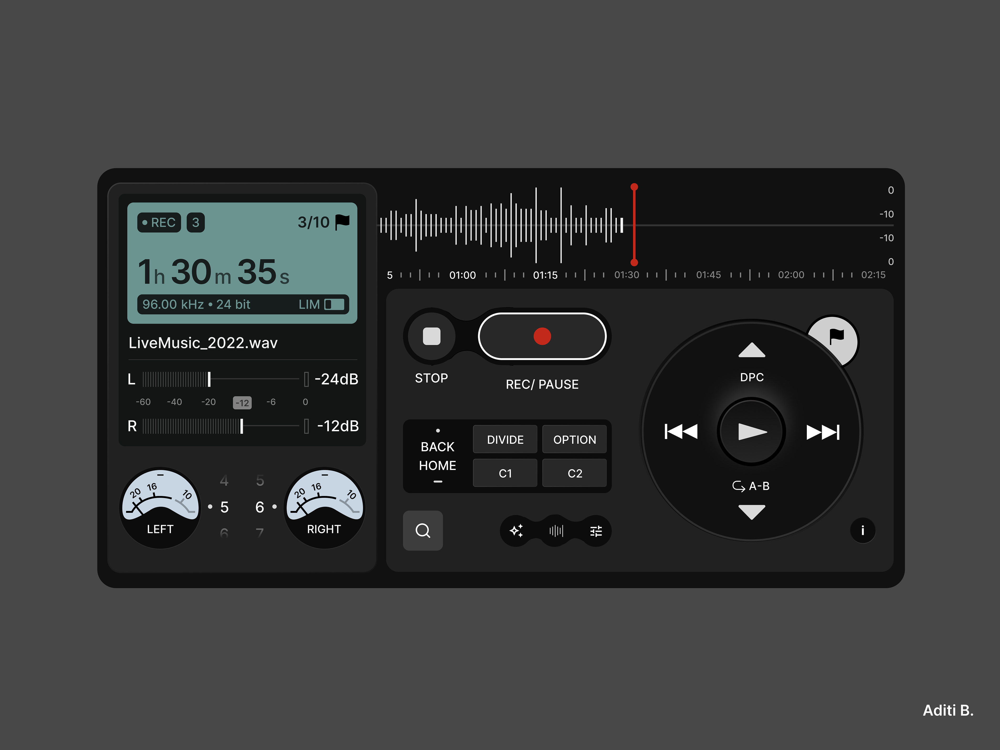
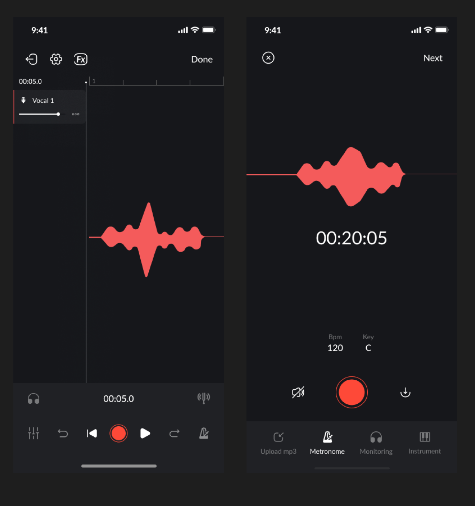

# Дизайн приложения для работы с аудио

Нужно чтобы хорошо и удобно было работать как с телефона так и с компьютера

Версия для пк будет скорее всего для тех кто создает контент, а мобильная - для остальных языков.

Судя по всему, самые хорошие ui/ux дизайны у стандартных приложений на телефоне для звукозаписи. У меня нет айфона, но в стандартном приложении для самсунга все сделано достаточно удобно.

Если в версии для ПК у нас много места на экране, и можно легко расположить все интерфейсы управления, то в версии для телефона это сделать сложнее.

Самый понятный вариант, который я увидел - это делать экран для одного или нескольких однотипных действий.

## Самсунг

Если еще ничего не записано - то одна кнопка для записи, сверху поле где будет видно звуковую волну. Чтобы понимать что действительно что-то записывается, и чтобы видеть динамику, громкость, или к примеру шумы. Я думаю что визуально надо чтобы хотя бы секунд 10 помещалось на экран (на скрине 8). Очень хорошо что тут есть шкала времени, при записи удобно видеть свой прогресс.

Процесс записи. Пишется время, показывается звуковая волна, в процессе записи ты можешь ставить метки для себя, из управления только три кнопки, пауза, чтобы приостановить запись, стоп - это значит сохранить запись, и плей, чтобы прослушать, во время записи она не активна.

Когда ты нажал на паузу - можно свайпом влево вправо двигать звуковую волну. Кнопка паузы по центру превращается снова в кнопку записи. И ты можешь в любом месте перезаписать аудио. Перезапись идет так, что ты просто поверх пишешь, этот участок выделяется красным. Есть одна функция, которую я бы хотел тут видеть. Сейчас ты просто пишешь поверх, но что если ты к примеру запнулся и пропустил целую фразу. По этому тут бы какой-то переключатель, типа или дописать, или перезаписать. Дописать - тогда он в том месте, где у тебя указатель, вставляет твою запись, как бы раздигает аудиодорожку.

В любой момент можно нажать на синюю кнопку Закладка, и на аудио дорожке появляется маркер. Удобно что его можно прям во время записи нажать, если к примеру ты понял что запнулся, но хочешь не останавливаться а все же дозаписать все аудио.

После того как ты нажимаешь Стоп, у тебя запись сохраняется. Теперь ты можешь ее прослушивать. Есть текущее время курсора, общее время записи, быстрая перемотка, она зависит от длины файла. Тут короткий, по этому по 1 секунде, в минутной записи к примеру идет перемотка по 3 секунды. При клике на скорость появляется ползунок, шаг 0.1. Повторить от А до Б это стандартная штука плееров, слушать какой-то кусочек покругу.

Кнопка Список открывает список закладок, можно их удалить, или дать имя. Этот режим работает когда прослушиваешь, тап по закладке перематывает. Подсвечивает синим он если время больше или равно метке. Очень удобно будет если разметка будет по стихам.

Редактирование. С того места, где стоит курсор, можно перезаписывать дорожку. Если к примеру это конец файла, то он продолжает запись, и так она становится длиньше. Ты можешь выделить зону и провести с ней операцию. Или удалить ее, или удалить все остальное, кроме нее.

Понравилась подсказка. Она акцентирует на визуальную часть, чтобы не запутать человека.

После редактирования 2 варианта, перезаписать исходник или создать новый файл.

## Другие приложения

Общая полоска аудио внизу, чтобы можно было проще скроллить по ней.

Надо подумать, что лучше. Или фиксированный зум и полоска, или же добавить ползунок с зумом и оставить только аудио дорожку.

Вместо значка Stop может лучше сделать кнопку done. И хорошо было бы дать возможность отменить изменение.

Тут тоже очень простой интерфейс и еще плюс, что маркеры начала и конца тут с двух сторон сделаны. Даже если они будут очень близко друг к другу - ты их будешь видеть.

Еще один вариант плеера, есть удаление, скорость, запись, редактирование, обрезка. Мне кажется ножницы - это лучший значок для обрезки.

Здесь очень интересный дизайн. Мне напоминает профессиональные устройства для записи, типа Zoom

Не знаю, может тут можно будет что-то взять для вдохновения. Но тут у тебя все на экране, мне кажется что лучше создать несколько экранов, для прослушивания, для редактирования, для каких-то настроек.

Это приложение для создания музыки, тут мультитрек записывать можно, по этому оно немного перегружено кнопками, но просто как идея для горизонтального вида.

Кстати, вот так выглядит самсунг

Было бы прикольно подключить транскрибацию в реальном времени. Но я сейчас потестировал, оказывается для этого нужен интернет. Без интернета это работать не будет.

С другой стороны, если мы говорим про криэйторов контента, то у них есть доступ к интернету, по этому. У самсунга очень круто это реализовано.

В процессе записи голоса у тебя появляется текст. При прослушивании текст подсвечивается синим, так же как и звуковая дорожка. Клик по любому слову перематывает к этому слову. Слово подсвечивается желтым если на нем сделана закладка. В режиме редактирования ты можешь кликнуть по любому слову и исправить его, если распознал не правильно.
